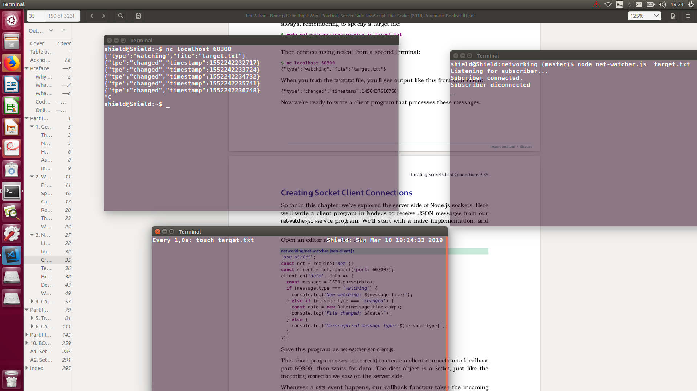
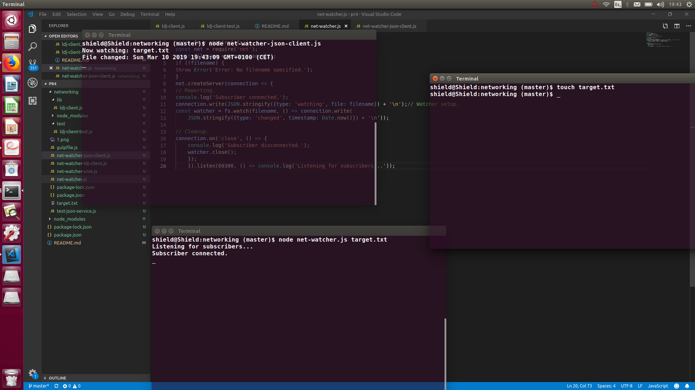
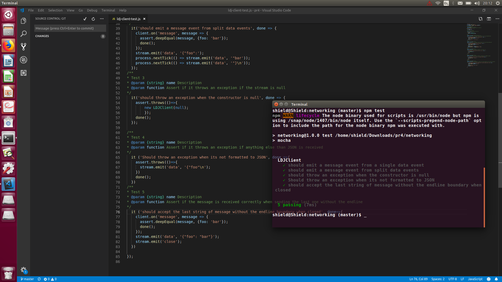

Akshay Chatani Chatani

Para empezar aprendemos como funciona un servidor en NODE js . Basicamente se trata de que una maquina haga un bind (a un puerto y una ip) y otra se conecte a esa direccion y puerto , al igual que pasa con las lineas telefonicas. EL telefono se queda haciendo un bind a nuestro numero de telefono y cuando alguien nos llama (se conecta) le respondemos y empieza una conexion.

En el fichero net-watcher.js utilizamos los conocimientos aprendidos del anterior capitulo y vigilamos un fichero. La diferencia es que en esta ocasion lanzamos los mensajes con formato JSON y antes de enviarlos los pasamos por la funcion de JSON stringify() para que obtengan ese formato JSON y se puedan interpretar con facilidad en el destino. El resultado lo enviamos por el stream de la conexión establecida para que llegue al usuario que se conecte a nuestro servidor.

Por el otro lado para que los mensajes aparezcan adecuadamente tenemos que conseguir que el cliente los interprete correctamente como JSON y los mande como nosotros queremos. Para eso en el cliente por cada mensaje recibido lo pasamos por el JSON Parse() y de ahi podemos clasificar cada tipo de JSON y su key-value. Eso lo podemos imprimir por la consola como nosotros queramos y habremos terminado el protocolo JSON

Probamos esto facilmente y este es el resultado

Sin interpretar los JSON correctamente:

;

Interpretandolos correctamente:

;

Por ahora el codigo no esta perfecto. Ya que si se mandan mensajes muy grandes no se podría mandar todo en un solo "chunk" de dato y entonces los mensajes no llegarían correctamente ya que nuestro programa no sabe cuando acaba un mensaje de evento. Por tanto introducimos los boundary /n despues de cada uno de los mensajes para poder separarlos y para ello hicimos un modulo de la clase Eventemitter y la extendimos para que haga esto. Dividimos los mensajes estableciendo el fin de cada uno de ellos con el string de endline /n y cada vez que se encontraba un caracter de esto enviabamos hasta esa parte del mensaje y asi sucesivamente.

Semantic Versioning

Para la semántica de las versiones de cada uno de los productos se utiliza el formato de tres números separados por puntos del tipo x.x.x . El primero de estos números se denomina el mayor que hace refencia a grandes actualizaciones que pueden hacer que deje de ser compatible con las versiones anteriores. El segundo número hace referencia al minor que se actualiza cuando se añaden funcionalidades nuevas al código pero se sigue manteniendo las funcionalidades con las versiones anteriores. Por último, el tercer número se refiere al patch que hace referencia a los distintos arreglos de bugs que se solucionan.

Ejercicios:

;

Travis:

